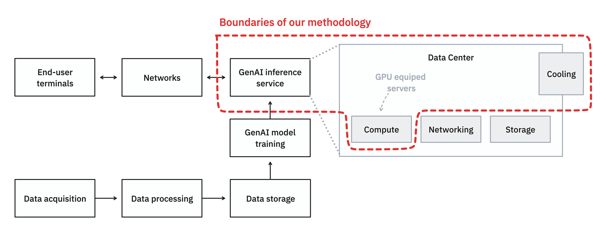

# Methodology

## Evaluation methodologies

The following methodologies are **currently available and implemented in EcoLogits**:

- [x] [LLM Inference](llm_inference.md)

Upcoming methodologies ([join us](https://genai-impact.org/contact) to help speed up our progress):

- [ ] Embeddings
- [ ] Image Generation
- [ ] Multi-Modal

## Methodological background

EcoLogits employs the **Life Cycle Assessment (LCA) methodology**, as defined by ISO 14044, to estimate the environmental impacts of requests made to generative AI inference services. This approach focuses on **multiple phases** of the lifecycle, specifically raw material extraction, manufacturing, transportation (denoted as embodied impacts), usage and end-of-life. Notably, we do not cover the end-of-life phase due to data limitations on e-waste recycling.

Our assessment considers **three key environmental criteria**:

- Global Warming Potential (GWP): Evaluates the impact on global warming in terms of CO2 equivalents.
- Abiotic Resource Depletion for Elements (ADPe): Assesses the consumption of raw minerals and metals, expressed in antimony equivalents.
- Primary Energy (PE): Calculates energy consumed from natural sources, expressed in megajoules.

Using a **bottom-up modeling approach**, we assess and aggregate the environmental impacts of all individual service components. This method differs from top-down approaches by allowing precise allocation of each resource's impact to the overall environmental footprint. The key advantage of bottom-up modeling is that our methodology can be customized for each provider that share information.

Our method computes **high-confidence approximation intervals**, providing a range of values within which we are confident enough that the true consumption lies.

Our current focus is on high-performance GPU-accelerated cloud instances, crucial for GenAI inference tasks. While we exclude impacts from training, networking, and end-user devices, we thoroughly evaluate the impacts associated with hosting and running the model inferences.

The methodology is grounded in **transparency** and **reproducibility**, utilizing open market and technical data to ensure our results are reliable and verifiable.

## Scope of the methodology

Our methodology focuses on **assessing the environmental impacts of GenAI inference tasks**. That is why we exclude impacts from training, networking and end-used devices, we thoroughly evaluate the impacts associated with hosting and running the model inferences.

<figure markdown="span">
  
  <figcaption>Boundaries of our impact assessment methodology.</figcaption>
</figure>

Because evaluating the environmental footprint of GenAI services is hard we make some **assumptions** to simplify the assessment. In the following section we will describe general hypotheses that we use, if you want to learn more about the specifics look at the according methodology page.  

## Hypotheses and limitations 

### Infrastructure and hardware

Environmental impacts are assessed by looking at the minimal required infrastructure to host the service. We account for the server and its components as well as the cooling equipments. Due to a lack of open data regarding the infrastructure overheads we do not take into account the networking and storage premises. We are also not accounting for underutilized or unused infrastructure. Meaning that we do not consider the average utilization rate of an infrastructure as well as the servers that are on and ready to accept request, but not in used due to a lack of end-user.

[//]: # (TODO: explain data centers PUE + inaccuracies)

### Impacts of electricity consumption

[//]: # (TODO: explain electricity mix and wordwide average + inaccuracies)

### Impacts of manufacturing hardware

[//]: # (TODO: explain embodied impacts and boaviztapi + inaccuracies)

### Benchmark of AI models

[//]: # (TODO: explain ai models benchmarks + inaccuracies)

### Proprietary AI models

1. Extrapolation from OS models (lack of data)
2. What is our methodology
    - Looking at evaluation benchmarks and compare to OS models
    - Looking at pricing differences
    - Leaked information
    - 

## Licenses and citations

All the methodologies are **licensed under [CC BY-SA 4.0](https://creativecommons.org/licenses/by-sa/4.0/)**

Please ensure that you adhere to the license terms and properly cite the authors and the GenAI Impact non-profit organization when utilizing this work. Each methodology has an associated paper with specific citation requirements.
