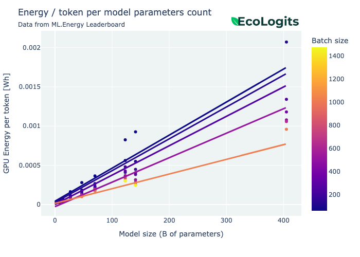
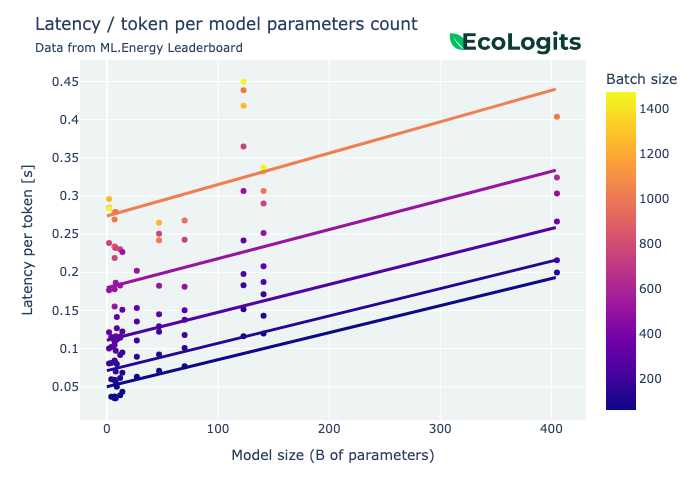

# Environmental Impacts of LLM Inference

## Introduction

The environmental impacts of a request, $I_{\text{request}}$ to a Large Language Model (LLM) can be divided into two components: the usage impacts, $I_{\text{request}}^{\text{u}}$, which account for energy consumption, and the embodied impacts, $I_{\text{request}}^{\text{e}}$, which account for resource extraction, hardware manufacturing, and transportation:

$$
\begin{equation*}
\begin{split}
I_{\text{request}}&=I_{\text{request}}^{\text{u}}  + I_{\text{request}}^{\text{e}} \\ 
&= E_{\text{request}} \times F_{\text{em}}+\frac{\Delta T}{\Delta L} \times I_{\text{server}}^{\text{e}}, 
\end{split}
\end{equation*}
$$

where $E_{\text{request}}$ represents the energy consumption of the IT resources associated with the request. $F_{\text{em}}$ denotes the impact factor of electricity consumption, which varies depending on the location and time. Furthermore, $I_{\text{server}}^{\text{e}}$ captures the embodied impacts of the IT resources, and $\frac{\Delta T}{\Delta L}$ signifies the hardware utilization factor, calculated as the computation time divided by the lifetime of the hardware.


## Usage impacts

To assess the usage impacts of an LLM inference, we first need to estimate the energy consumption of the server, which is equipped with one or more GPUs. We will also take into account the energy consumption of cooling equipment integrated with the data center, using the Power Usage Effectiveness (PUE) metric.

Subsequently, we can calculate the environmental impacts by using the $F_{\text{em}}$ impact factor of the electricity mix. Ideally, $F_{\text{em}}$ should vary with location and time to accurately reflect the local energy mix.

### Modeling GPU energy consumption

By leveraging the open dataset from the [ML.ENERGY Leaderboard](https://ml.energy/leaderboard/?__theme=light), we can estimate the energy consumption of the GPU using a parametric model. This leaderboard aims at being as close as possible to production conditions (vLLM on NVIDIA H100 GPUs, see [the paper](https://arxiv.org/pdf/2505.06371) for more information). 

??? info "On the ML.ENERGY dataset filtering"
    
    In order to have relevant data and avoid outliers, we have filtered the dataset to keep only (1) the benchmark on NVIDIA H100 80GB HBM3 GPUs, (2) batch sizes no larger than 512 and (3) models no larger than 200B parameters. 

We approximate energy consumption per output token as a function of the number of activate parameters, denoted as $P_{\text{active}}$, and the batch size, denoted as $B$. 

??? note "What are active parameters?"

    We distinguish between active parameters and total parameter count for Sparse Mixture-of-Experts (SMoE) models. The total parameter count is used to determine the number of required GPUs to load the model into memory. In contrast, the active parameter count is used to estimate the energy consumption of a single GPU. In practice, SMoE models exhibit lower energy consumption per GPU compared to dense models of equivalent size (in terms of total parameters).

    * For a dense model: $P_{\text{active}} = P_{\text{total}}$
    * For a SMoE model: $P_{\text{active}} =  P_{\text{total}} / \text{number of active experts}$

??? note "What is the batch size?"

    The batch size $B$ is the number of requests that the server can handle concurrently. A large batch size decreases the energy used for a unique request, but increases the latency. The providers aim at finding a good tradeoff between energy efficiency and latency. 

To be consistent with observed behaviors while staying relatively simple we opted to fit a function of the form

$$ 
f_E(P_{\text{active}}, B) = \alpha e^{\beta B} P_{\text{active}} + \gamma
$$

that is **linear** with $P_{\text{active}}$ and **exponential** with $B$. We fitted such a model with the data, and got 

- $\alpha = 6.47 \times 10^{-6}$, 
- $\beta = -2.60 \times 10^{-3}$, 
- $\gamma = 1.04 \times 10^{-5}$, 

The result is illustrated below. 

<figure markdown="span">
  
  <figcaption>Figure: Energy consumption (in Wh) per output token vs. number of active parameters (in billions). The points are the datapoints from the ML.ENERGY leaderboard, and the lines are the result of our regression for fixed batch sizes (64, 128, 256).</figcaption>
</figure>

!!! warning "From now on, we consider that the batch size is fixed to $B = 64$."


Using these values, we can estimate the energy consumption of a simple GPU for the entire request, given the number of output tokens $\#T_{\text{out}}$ and the number of active parameters $P_{\text{active}}$: 

$$ 
E_{\text{GPU}}(\#T_{\text{out}}, P_{\text{active}}) = \#T_{\text{out}} \times f_E(P_{\text{active}}, 64), 
$$

where $f_E$ is the linear-exponential model cited above. 

If the model requires multiple GPUs to be loaded into VRAM, the energy consumption $E_{\text{GPU}}$ should be multiplied by the number of required GPUs, $\text{GPU}$ (see [below](#complete-server-energy-consumption)).


### Modeling server energy consumption

To estimate the energy consumption of the entire server, we will use the previously estimated GPU energy model and separately estimate the energy consumption of the server itself (without GPUs), denoted as $E_{\text{server} \backslash \text{GPU}}$.

#### Server energy consumption without GPUs

To model the energy consumption of the server without GPUs, we consider a fixed power consumption, $W_{\text{server} \backslash \text{GPU}}$, during inference (or generation latency), denoted as $\Delta T$. We assume that the server hosts multiple GPUs, but not all of them are actively used for the target inference. Therefore, we account for a portion of the energy consumption based on the number of required GPUs, $\text{GPU}$. Finally, we divide by the batch size $B$ to account the server energy for a single request:

$$
E_{\text{server} \backslash \text{GPU}}(\Delta T) = \Delta T \times W_{\text{server} \backslash \text{GPU}} \times \frac{\text{GPU}}{\#\text{GPU}_{\text{installed}}} \times \frac{1}{B}.
$$

For a typical high-end GPU-accelerated cloud instance, we use $W_{\text{server} \backslash \text{GPU}} = 1$ kW and $\#\text{GPU}_{\text{installed}} = 8$.

#### Estimating the generation latency

The generation latency, $\Delta T$, is the duration of the inference measured on the server and is independent of networking latency. We estimate the generation latency using the [ML.ENERGY Leaderboard](https://ml.energy/leaderboard/?__theme=light) dataset with the previously mentioned filters applied.

To be consistent with observed behaviors while staying relatively simple we opted to fit a function of the form

$$ 
f_L(P_{\text{active}}, B) = \alpha P_{\text{active}} + \beta B + \gamma, 
$$

that is linear in both the number of parameters and the batch size. 

We find the values : 

- $\alpha = 6.78 \times 10^{-4}$, 
- $\beta = 3.12 \times 10^{-4}$, 
- $\gamma = 1.94 \times 10^{-2}$, 

The result is illustrated below. 

<figure markdown="span">
  
  <figcaption>Figure: Latency (in s) per output token vs. number of active parameters (in billions). The points are the datapoints from the ML.ENERGY leaderboard, and the lines are the result of our regression for fixed batch sizes (64, 128, 256)</figcaption>
</figure>

Using these values, we can estimate the generation latency for the entire request given the number of output tokens, $\#T_{\text{out}}$, and the number of active parameters, $P_{\text{active}}$. When possible, we also measure the request latency, $\Delta T_{\text{request}}$, and use it as the maximum bound for the generation latency:

$$
\Delta T(\#T_{\text{out}}, P_{\text{active}}, \Delta T_{\text{request}}) = \min \left\{ \#T_{\text{out}} \times f_L(P_{\text{active}}, 64), \Delta T_{\text{request}} \right\}.
$$

#### Estimating the number of active GPUs

To estimate the number of required GPUs, $\text{GPU}$, to load the model in virtual memory, we divide the required memory to host the LLM for inference, noted $M_{\text{model}}$, by the memory available on one GPU, noted $M_{\text{GPU}}$.

The required memory to host the LLM for inference is estimated based on the total number of parameters and the number of bits used for model weights related to quantization. We also apply a memory overhead of $1.2$ (see [Transformers Math 101 :octicons-link-external-16:](https://blog.eleuther.ai/transformer-math/#total-inference-memory)):

$$
M_{\text{model}}(P_{\text{total}},Q)=1.2 \times \frac{P_{\text{total}} \times Q}{8}.
$$

We then estimate the number of required GPUs, rounded up:

$$
\text{GPU}(P_{\text{total}},Q,M_{\text{GPU}}) = \left\lceil \frac{M_{\text{model}}(P_{\text{total}},Q)}{M_{\text{GPU}}} \right\rceil.
$$

To stay consistent with previous assumptions based on [ML.ENERGY Leaderboard](https://ml.energy/leaderboard/?__theme=light) data, we use $M_{\text{GPU}} = 80$ GB for an NVIDIA H100 80GB GPU.

#### Complete server energy consumption

The total server energy consumption for the request, $E_{\text{server}}$, is computed as follows:

$$
E_{\text{server}} = E_{\text{server} \backslash \text{GPU}} + \text{GPU} \times E_{\text{GPU}}.
$$

### Modeling request energy consumption

To estimate the energy consumption of the request, we multiply the previously computed server energy by the Power Usage Effectiveness (PUE) to account for cooling equipment in the data center:

$$
E_{\text{request}} = \text{PUE} \times E_{\text{server}}.
$$

### Modeling request usage environmental impacts

To assess the environmental impacts of the request for the usage phase, we multiply the estimated electricity consumption by the impact factor of the electricity mix, $F_{\text{em}}$, specific to the target country and time. We use data from the [Our World in Data](https://ourworldindata.org/electricity-mix) for GWP impact and from the [ADEME Base Empreinte®](https://base-empreinte.ademe.fr/) for ADPe and PE impacts. It gives us:

$$
I^\text{u}_{\text{request}} = E_{\text{request}} \times F_{\text{em}}.
$$

#### Modeling request water consumption footprint for usage phase

To assess the Water Consumption Footprint (WCF) for the usage phase we use the modeling from [Li et al. (2025)](https://arxiv.org/abs/2304.03271). It uses the Water Usage Effectiveness (WUE) of both the data center $\text{WUE}_\text{on-site}$ and of the local electricity mix $\text{WUE}_\text{off-site}$. On-site data is assessed for each provider individually, whereas off-site data is averaged from each country according to the [World Resource Institute methodology](https://www.wri.org/research/guidance-calculating-water-use-embedded-purchased-electricity). It gives us:

$$
\text{WCF}^{\text{u}}_\text{request} = E_\text{server} \times [\text{WUE}_\text{on-site} + \text{PUE} \times \text{WUE}_\text{off-site}].
$$


## Embodied impacts

To determine the embodied impacts of an LLM inference, we need to estimate the **hardware configuration** used to host the model and its lifetime. Embodied impacts account for resource extraction (e.g., minerals and metals), manufacturing, and transportation of the hardware.

### Modeling server embodied impacts

To estimate the embodied impacts of IT hardware, we use the [BoaviztAPI](https://github.com/Boavizta/boaviztapi) tool from the non-profit organization [Boavizta](https://boavizta.org/en/). This API embeds a bottom-up multicriteria environment impact estimation engine for embodied and usage phases of IT resources and services. We focus on estimating the embodied impacts of a server and a GPU. BoaviztAPI is an open-source project that relies on open databases and open research on environmental impacts of IT equipment.

#### Server embodied impacts without GPU

To assess the embodied environmental impacts of a high-end AI server, we use an AWS cloud instance as a reference. We selected the `p5.48xlarge` instance, as it corresponds to a server that can be used for LLM inference with eight NVIDIA H100 80GB GPU cards. The embodied impacts of this instance will be used to estimate the embodied impacts of the server without GPUs, denoted as $I^{\text{e}}_{\text{server} \backslash \text{GPU}}$.

The embodied environmental impacts of the cloud instance are:

|                 | Server (without GPU) |
|-----------------|----------------------|
| GWP (kgCO2eq)   | $5700$               |
| ADPe (kgSbeq)   | $0.37$               |
| PE (MJ)         | $70,000$             |

!!! warning "These impacts do not take into account the eight GPUs. ([see below](#gpu-embodied-impacts))"

??? info "Example request to reproduce this calculation"

    On the cloud instance route (/v1/cloud/instance) you can POST the following JSON.
    
    ```json
    {
        "provider": "aws",
        "instance_type": "p5.48xlarge"
    }
    ```

    Or you can use the demo available demo API with this command using `curl` and parsing the JSON output with `jq`.

    ```shell
    curl -X 'POST' \
        'https://api.boavizta.org/v1/cloud/instance?verbose=true&criteria=gwp&criteria=adp&criteria=pe' \
        -H 'accept: application/json' \
        -H 'Content-Type: application/json' \
        -d '{
        "provider": "aws",
        "instance_type": "p5.48xlarge"
    }' | jq
    ```

#### GPU embodied impacts

According to this [NVIDIA datasheet](https://images.nvidia.com/aem-dam/Solutions/documents/HGX-H100-PCF-Summary.pdf), a NVIDIA H100 80GB GPU has a GWP of 164 kgCO2eq. To approximate the ADPe and PE, we rely on the Boavizta methodology for previous A100 GPUs. These values will be used to estimate the embodied impacts of a single GPU, denoted as $I^{\text{e}}_{\text{GPU}}$.

|                | NVIDIA H100 80GB      |
|----------------|-----------------------|
| GWP (kgCO2eq)  | $164$                 |

|                | NVIDIA A100 80GB      |
|----------------|-----------------------|
| ADPe (kgSbeq)  | $5.09 \times 10^{-3}$ |
| PE (MJ)        | $1,828$               |

!!! warning "The GPU embodied impacts will be soon available in the BoaviztAPI tool."


#### Complete server embodied impacts

The final embodied impacts for the server, including the GPUs, are calculated as follows. Note that the embodied impacts of the server without GPUs are scaled by the number of GPUs required to host the model. This allocation is made to account for the fact that the remaining GPUs on the server can be used to host other models or multiple instances of the same model. As we are estimating the impacts of a single LLM inference, we need to exclude the embodied impacts that would be attributed to other services hosted on the same server:

$$
I^{\text{e}}_{\text{server}}=\frac{\text{GPU}}{\#\text{GPU}_{\text{installed}}} \times I^{\text{e}}_{\text{server} \backslash \text{GPU}} + \text{GPU} \times I^{\text{e}}_{\text{GPU}}.
$$


### Modeling request embodied environmental impacts

To allocate the server embodied impacts to the request, we use an allocation based on the hardware utilization factor, $\frac{\Delta T}{B \times \Delta L}$. In this case, $\Delta L$ represents the lifetime of the server and GPU, which we fix at 3 years (according to [this NVIDIA report](https://images.nvidia.com/aem-dam/Solutions/documents/HGX-H100-PCF-Summary.pdf)), and $B$ is the batch size such as above: 

$$
I^{\text{e}}_{\text{request}}=\frac{\Delta T}{B \times  \Delta L} \times I^{\text{e}}_{\text{server}}.
$$

!!! warning "Water consumption (WCF) impact is not modeled for the embodied phase due to a lack of data."


## Additional data

### Data center configuration

We use public data from AI providers to their **data center configuration** such as the default **deployment location** and the **PUE** and **WUE**. The table below outlines the different hypothesis we currently use. The full details and sources are available in the [supplemental material](https://docs.google.com/spreadsheets/d/1XkPTkrGxpwWpIVIxpVvgRJuInSZsqbndTQbFGcHhdd0/) in the "providers" tab. 

| AI Provider     | Cloud Provider | Location | PUE         | WUE         |
|-----------------|----------------|----------|-------------|-------------|
| Anthropic       | AWS, Google    | USA      | 1.09 - 1.14 | 0.13 - 0.99 |
| Cohere          | Google         | USA      | 1.09        | 0.99        |
| Google          | Google         | USA      | 1.09        | 0.99        |
| HuggingFace Hub | AWS, Google    | USA      | 1.09 - 1.14 | 0.13 - 0.99 |
| Mistral AI      | Microsoft      | SWE, NOR | 1.16        | 0.09        |
| OpenAI          | Microsoft      | USA      | 1.20        | 0.569       |
| Azure OpenAI    | Microsoft      | USA      | 1.20        | 0.569       |


## Assumptions and limitations

To be able to estimate environmental impacts of LLMs at inference we took the approach of modeling the key components that compose the service. In this section we will list major assumptions we make when modeling environmental impacts as well as known limitations. When possible we will try to quantify the potential inaccuracies.

### On models

Two major information we are looking for is the required infrastructure to host the AI model, such as the number of GPUs as well as the energy consumption that results from doing an inference on the model.

Assuming the **required infrastructure** for open models can be relatively straightforward because the model size is known. But for proprietary models this can very be challenging given that some AI provider do not disclose any technical information on that matter. That's why we rely on estimations of parameters count for closed models, to learn more [read the dedicated section](proprietary_models.md).

Assuming the **energy consumption** for AI models is done through benchmarking open models. We tend to rely on external sources for benchmarking, but we conduct our own experiments as well. Because of our limited capacity and the technical complexity to host very big AI models we extrapolate the consumption of smaller models to bigger models.

**Assumptions:**

* Models are deployed with vLLM backend.
* Models are quantized to 4 bits.

**Limitations:**

* We do not account for some inference optimizations such as flash attention. 
* We do not have benchmarks for multi-GPU deployments.
* We do not account for the multiple modalities of a model (only text-to-text generation).

### On hardware

We estimate the **required infrastructure** to run the service in terms of hardware. We consider that the service is hosted in the cloud on servers equipped with high-end GPUs. 

**Assumptions:**

* Models are deployed on NVIDIA H100 GPUs with 80GB of memory.
* Base servers are similar to p5.48xlarge AWS cloud instances.

**Limitations:**

* We do not account for TPUs or other type of accelerators.
* We do not account for networking or storage primitives.
* We do not account for infrastructure overheads or utilization factors.

### On data centers

The type of services we model rely on high-end hardware that we consider is hosted by cloud service providers. Thus, we model data centers impacts as well and especially the overhead for cooling equipments.

We consider the **Power Usage Effectiveness** (PUE) metric from data centers. These values can be quite complicated to get from the providers themselves. A good amount of data is available for providers that build their own data centers (such as hyperscalers). But part of the AI workloads are also located in non-hyperscale data centers or in co-located data centers. For each data center provider, we use the PUE number published by them on a global average.


**Limitations:**

* We do not know precisely where are located the data centers that run AI models.
* We do not account for the specific infrastructure or way to cooldown servers in data centers.
* We do not account for the local electricity generation (private power plants) specific to the data center.
* We do not account for the overhead of the cloud provider for internal services like backing up or monitoring.

The water consumption for the production of electricity varies widely by regions, and you could consider checking out our [environmental impact simulator](https://huggingface.co/spaces/genai-impact/ecologits-calculator) to find out about regional differences.  


### On impact factors

To transform physical values such as energy consumption into environmental impacts we use **impact factors**. These can be hard to estimate and precise and up-to-date data is rarely open to use.

**Assumptions:**

* Electricity mix are taken from the ADEME Base Empreinte database and averaged per country.

**Limitations:**

* We do not account for local electricity generation for data center or regional electricity mixes the smallest supported zone is a country.

### On embodied impacts

We aim at covering the largest scope possible when assessing the environmental impacts. That is why we rely extensively on the work done by [Boavizta](https://boavizta.org/) non-profit. Unfortunately, assessing the environmental impacts of resources extraction, hardware manufacturing and transportation is very challenging mainly due to a lack of transparency from all the organizations that are involved. Estimations of the inaccuracies are currently not supported within Boavizta's methodology and tool ([BoaviztAPI](https://doc.api.boavizta.org/)).


## References

- [ML.ENERGY Leaderboard](https://ml.energy/leaderboard/?__theme=light) to estimate GPU energy consumption and latency based on the model architecture and number of output tokens.
- [BoaviztAPI](https://github.com/Boavizta/boaviztapi) to estimate server embodied impacts and base energy consumption.
- [Our World in Data](https://ourworldindata.org/), [ADEME Base Empreinte®](https://base-empreinte.ademe.fr/) and [World Resource Institute](https://www.wri.org/) for electricity mix impacts per country.

## :material-bookshelf: Citation

Please cite **GenAI Impact** non-profit organization and **link to this documentation page**. 

```bibtex
@article{ecologits, 
    doi = {10.21105/joss.07471}, 
    url = {https://doi.org/10.21105/joss.07471}, 
    year = {2025}, 
    publisher = {The Open Journal}, 
    volume = {10}, number = {111}, pages = {7471}, 
    author = {Rincé, Samuel and Banse, Adrien}, 
    title = {EcoLogits: Evaluating the Environmental Impacts of Generative AI}, 
    journal = {Journal of Open Source Software}
}
```

## :material-scale-balance: License

**This work is licensed under [CC BY-SA 4.0](https://creativecommons.org/licenses/by-sa/4.0/)**


