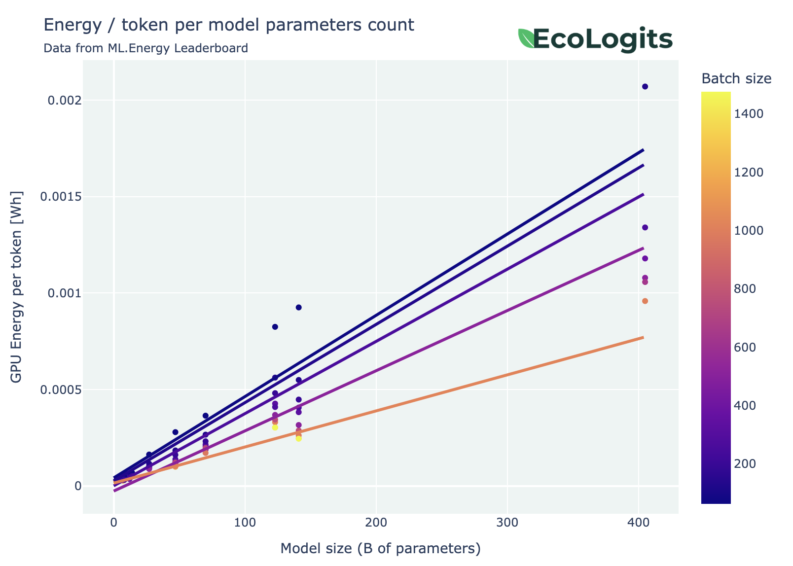
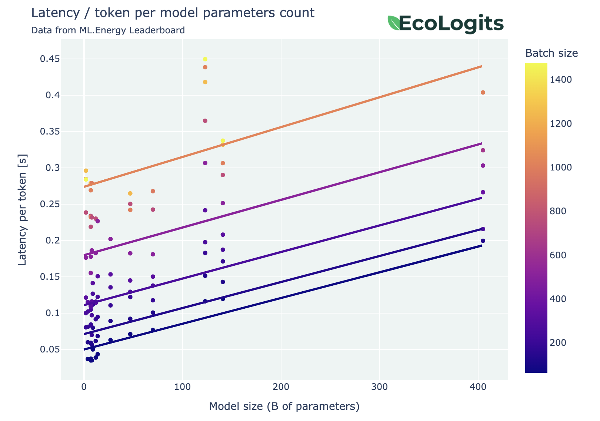

# Environmental Impacts of LLM Inference

<span class="badge" makdown>
    <span class="badge__icon">:material-tag-outline:</span>
    <span class="badge__text">v1.0</span>
</span>

??? info "Known limitations and hypotheses"
    
    - Based on a production setup: models are quantized, high-end servers with A100...
    - We currently assume that the used electricity mix correspond only to national average mixes (taken from the [ADEME Base Empreinte®](https://base-empreinte.ademe.fr/)). If the user does not specify the country, the world average mix is used. 
    - Model architectures are assumed when not dislosed by the provider.
    - Not accounting the impacts of unused cloud resources, data center building, network and end-user devices, model training and data collection...
    - Not tested on multi-modal models for text-to-text generation only.

The environmental impacts of a request, $I_{\text{request}}$ to a Large Language Model (LLM) can be divided into two components: the usage impacts, $I_{\text{request}}^{\text{u}}$, which account for energy consumption, and the embodied impacts, $I_{\text{request}}^{\text{e}}$, which account for resource extraction, hardware manufacturing, and transportation:

$$
\begin{equation*}
\begin{split}
I_{\text{request}}&=I_{\text{request}}^{\text{u}}  + I_{\text{request}}^{\text{e}} \\ 
&= E_{\text{request}} \times F_{\text{em}}+\frac{\Delta T}{\Delta L} \times I_{\text{server}}^{\text{e}}, 
\end{split}
\end{equation*}
$$

where $E_{\text{request}}$ represents the energy consumption of the IT resources associated with the request. $F_{\text{em}}$ denotes the impact factor of electricity consumption, which varies depending on the location and time. Furthermore, $I_{\text{server}}^{\text{e}}$ captures the embodied impacts of the IT resources, and $\frac{\Delta T}{\Delta L}$ signifies the hardware utilization factor, calculated as the computation time divided by the lifetime of the hardware.


## Usage impacts

To assess the usage impacts of an LLM inference, we first need to estimate the energy consumption of the server, which is equipped with one or more GPUs. We will also take into account the energy consumption of cooling equipment integrated with the data center, using the Power Usage Effectiveness (PUE) metric.

Subsequently, we can calculate the environmental impacts by using the $F_{\text{em}}$ impact factor of the electricity mix. Ideally, $F_{\text{em}}$ should vary with location and time to accurately reflect the local energy mix.

### Modeling GPU energy consumption

By leveraging the open dataset from the [LLM Perf Leaderboard](https://huggingface.co/spaces/optimum/llm-perf-leaderboard), produced by Hugging Face, we can estimate the energy consumption of the GPU using a parametric model.

We fit a linear regression model to the dataset, which models the energy consumption per output token as a function of the number of active parameters in the LLM, denoted as $P_{\text{active}}$.

??? note "What are active parameters?"

    We distinguish between active parameters and total parameter count for Sparse Mixture-of-Experts (SMoE) models. The total parameter count is used to determine the number of required GPUs to load the model into memory. In contrast, the active parameter count is used to estimate the energy consumption of a single GPU. In practice, SMoE models exhibit lower energy consumption per GPU compared to dense models of equivalent size (in terms of total parameters).

    * For a dense model: $P_{\text{active}} = P_{\text{total}}$
    * For a SMoE model: $P_{\text{active}} =  P_{\text{total}} / \text{number of active experts}$

??? info "On the LLM Perf Leaderboard dataset filtering"
    
    We have filtered the dataset to keep relevant data points for the analysis. In particular we have applied the following conditions:
    
    * Model number of parameters >= 7B
    * Keep dtype set to float16
    * GPU model is "NVIDIA A100-SXM4-80GB"
    * No optimization
    * 8bit and 4bit quantization excluding bitsandbytes (bnb)


<figure markdown="span">
  
  <figcaption>Figure: Energy consumption (in Wh) per output token vs. number of active parameters (in billions)</figcaption>
</figure>

??? info "What is a 95% confidence interval?"

    The standard deviation $\delta$ of a linear regression measures "how close are the datapoints to the fitted line". A priori, the larger it is, the worse is the approximation. Consider a linear regression $Y(x) \approx \alpha x + \beta$. Given some assumptions, we can say that $Y(x) \in [\alpha x + \beta - 1.96\delta, \alpha x + \beta + 1.96\delta]$ with probability 95% (see [[1]](https://en.wikipedia.org/wiki/Linear_regression) and [[2]](https://en.wikipedia.org/wiki/97.5th_percentile_point) for more details).

In our methodology, **in order to take into account approximation errors as much as possible**, we provide the **95% confidence interval** of our linear approximation. The computed linear regression gives a confidence interval of

$$
\frac{E_{\text{GPU}}}{\#T_{\text{out}}} = \alpha \times P_{\text{active}} + \beta \pm 1.96 \sigma, 
$$

with $\alpha = 8.91e-5$, $\beta = 1.43e-3$ and $\sigma = 5.19e-4$. 

Using these values, we can estimate the energy consumption of a simple GPU for the entire request, given the number of output tokens $\#T_{\text{out}}$ and the number of active parameters $P_{\text{active}}$:

$$
E_{\text{GPU}}(\#T_{\text{out}}, P_{\text{active}}) = \#T_{\text{out}} \times (\alpha \times P_{\text{active}} + \beta \pm 1.96 \sigma).
$$

If the model requires multiple GPUs to be loaded into VRAM, the energy consumption $E_{\text{GPU}}$ should be multiplied by the number of required GPUs, $\text{GPU}$ (see [below](#complete-server-energy-consumption)).


### Modeling server energy consumption

To estimate the energy consumption of the entire server, we will use the previously estimated GPU energy model and separately estimate the energy consumption of the server itself (without GPUs), denoted as $E_{\text{server} \backslash \text{GPU}}$.

#### Server energy consumption without GPUs

To model the energy consumption of the server without GPUs, we consider a fixed power consumption, $W_{\text{server} \backslash \text{GPU}}$, during inference (or generation latency), denoted as $\Delta T$. We assume that the server hosts multiple GPUs, but not all of them are actively used for the target inference. Therefore, we account for a portion of the energy consumption based on the number of required GPUs, $\text{GPU}$:

$$
E_{\text{server} \backslash \text{GPU}}(\Delta T) = \Delta T \times W_{\text{server} \backslash \text{GPU}} \times \frac{\text{GPU}}{\#\text{GPU}_{\text{installed}}}.
$$

For a typical high-end GPU-accelerated cloud instance, we use $W_{\text{server} \backslash \text{GPU}} = 1$ kW and $\#\text{GPU}_{\text{installed}} = 8$.

#### Estimating the generation latency

The generation latency, $\Delta T$, is the duration of the inference measured on the server and is independent of networking latency. We estimate the generation latency using the [LLM Perf Leaderboard](https://huggingface.co/spaces/optimum/llm-perf-leaderboard) dataset with the previously mentioned filters applied.

We fit a linear regression model on the dataset modeling the generation latency per output token given the number of active parameters of the LLM $P_{\text{active}}$:

<figure markdown="span">
  
  <figcaption>Figure: Latency (in s) per output token vs. number of active parameters (in billions)</figcaption>
</figure>

Again, we propagate 95% confidence intervals through our computations. The fit gives an interval of

$$
\frac{\Delta T}{\#T_{\text{out}}} = \alpha \times P_{\text{active}} + \beta \pm 1.96\delta, 
$$

with $\alpha = 8.02e-4$, $\beta = 2.23e-2$ and $\delta = 7.00e-6$. Using these values, we can estimate the generation latency for the entire request given the number of output tokens, $\#T_{\text{out}}$, and the number of active parameters, $P_{\text{active}}$. When possible, we also measure the request latency, $\Delta T_{\text{request}}$, and use it as the maximum bound for the generation latency:

$$
\Delta T(\#T_{\text{out}}, P_{\text{active}}) = \#T_{\text{out}} \times (\alpha \times P_{\text{active}} + \beta \pm 1.96\delta).
$$

With the request latency, the generation latency is defined as follows:

$$
\Delta T(\#T_{\text{out}}, P_{\text{active}}, \Delta T_{\text{request}}) = \min \left\{ \#T_{\text{out}} \times (\alpha \times P_{\text{active}} + \beta \pm 1.96 \delta), \Delta T_{\text{request}} \right\}.
$$

#### Estimating the number of active GPUs

To estimate the number of required GPUs, $\text{GPU}$, to load the model in virtual memory, we divide the required memory to host the LLM for inference, noted $M_{\text{model}}$, by the memory available on one GPU, noted $M_{\text{GPU}}$.

The required memory to host the LLM for inference is estimated based on the total number of parameters and the number of bits used for model weights related to quantization. We also apply a memory overhead of $1.2$ (see [Transformers Math 101 :octicons-link-external-16:](https://blog.eleuther.ai/transformer-math/#total-inference-memory)):

$$
M_{\text{model}}(P_{\text{total}},Q)=1.2 \times \frac{P_{\text{total}} \times Q}{8}.
$$

We then estimate the number of required GPUs, rounded up:

$$
\text{GPU}(P_{\text{total}},Q,M_{\text{GPU}}) = \left\lceil \frac{M_{\text{model}}(P_{\text{total}},Q)}{M_{\text{GPU}}} \right\rceil.
$$

To stay consistent with previous assumptions based on LLM Perf Leaderboard data, we use $M_{\text{GPU}} = 80$ GB for an NVIDIA A100 80GB GPU.

#### Complete server energy consumption

The total server energy consumption for the request, $E_{\text{server}}$, is computed as follows:

$$
E_{\text{server}} = E_{\text{server} \backslash \text{GPU}} + \text{GPU} \times E_{\text{GPU}}.
$$

### Modeling request energy consumption

To estimate the energy consumption of the request, we multiply the previously computed server energy by the Power Usage Effectiveness (PUE) to account for cooling equipment in the data center:

$$
E_{\text{request}} = \text{PUE} \times E_{\text{server}}.
$$

We typically use a $\text{PUE} = 1.2$ for hyperscaler data centers or supercomputers.

### Modeling request usage environmental impacts

To assess the environmental impacts of the request for the usage phase, we multiply the estimated electricity consumption by the impact factor of the electricity mix, $F_{\text{em}}$, specific to the target country and time. **Unless otherwise stated, we currently use a worldwide average multicriteria impact factor from the [ADEME Base Empreinte®](https://base-empreinte.ademe.fr/)**:

$$
I^\text{u}_{\text{request}} = E_{\text{request}} \times F_{\text{em}}.
$$

Note that the user can still chose another electricity mix from the [ADEME Base Empreinte®](https://base-empreinte.ademe.fr/).

??? note "Some values of $F_{\text{em}}$ per geographical area"
        
    | Area or country                                                           | GWP (gCO2eq / kWh) | ADPe (kgSbeq / kWh) | PE (MJ / kWh) |
    |---------------------------------------------------------------------------|--------------------|---------------------|---------------|
    | 🌐 Worldwide                                                              | $590.4$            | $7.378 \times 10^{-8}$   | $9.99$  |
    | 🇪🇺 Europe ([EEA](https://en.wikipedia.org/wiki/European_Economic_Area)) | $509.4$            | $6.423 \times 10^{-8}$   | $12.9$  |
    | 🇺🇸 USA                                                                  | $679.8$            | $9.855 \times 10^{-8}$   | $11.4$  |
    | 🇨🇳 China                                                                | $1,057$            | $8.515 \times 10^{-8}$   | $14.1$  |
    | 🇫🇷 France                                                               | $81.3$            | $4.858 \times 10^{-8}$   | $11.3$     |


## Embodied impacts

To determine the embodied impacts of an LLM inference, we need to estimate the **hardware configuration** used to host the model and its lifetime. Embodied impacts account for resource extraction (e.g., minerals and metals), manufacturing, and transportation of the hardware.

### Modeling server embodied impacts

To estimate the embodied impacts of IT hardware, we use the [BoaviztAPI](https://github.com/Boavizta/boaviztapi) tool from the non-profit organization [Boavizta](https://boavizta.org/en/). This API embeds a bottom-up multicriteria environment impact estimation engine for embodied and usage phases of IT resources and services. We focus on estimating the embodied impacts of a server and a GPU. BoaviztAPI is an open-source project that relies on open databases and open research on environmental impacts of IT equipment.

#### Server embodied impacts without GPU

To assess the embodied environmental impacts of a high-end AI server, we use an AWS cloud instance as a reference. We selected the `p4de.24xlarge` instance, as it corresponds to a server that can be used for LLM inference with eight NVIDIA A100 80GB GPU cards. The embodied impacts of this instance will be used to estimate the embodied impacts of the server without GPUs, denoted as $I^{\text{e}}_{\text{server} \backslash \text{GPU}}$.

The embodied environmental impacts of the cloud instance are:

|                 | Server (without GPU) |
|-----------------|----------------------|
| GWP (kgCO2eq)   | $3000$               |
| ADPe (kgSbeq)   | $0.25$               |
| PE (MJ)         | $39,000$             |

!!! warning "These impacts does not take into account the eight GPUs. ([see below](#gpu-embodied-impacts))"

??? info "Example request to reproduce this calculation"

    On the cloud instance route (/v1/cloud/instance) you can POST the following JSON.
    
    ```json
    {
        "provider": "aws",
        "instance_type": "p4de.24xlarge"
    }
    ```

    Or you can use the demo available demo API with this command using `curl` and parsing the JSON output with `jq`.

    ```shell
    curl -X 'POST' \
        'https://api.boavizta.org/v1/cloud/instance?verbose=true&criteria=gwp&criteria=adp&criteria=pe' \
        -H 'accept: application/json' \
        -H 'Content-Type: application/json' \
        -d '{
        "provider": "aws",
        "instance_type": "p4de.24xlarge"
    }' | jq
    ```

#### GPU embodied impacts

Boavizta is currently developing a methodology to provide multicriteria embodied impacts for GPU cards. For this analysis, we use the embodied impact data they computed for a NVIDIA A100 80GB GPU. These values will be used to estimate the embodied impacts of a single GPU, denoted as $I^{\text{e}}_{\text{GPU}}$.

|                 | NIDIA A100 80GB  |
|-----------------|------------------|
| GWP (kgCO2eq) | $143$              |
| ADPe (kgSbeq) | $5.09 \times 10^{-3}$ |
| PE (MJ)       | $1,828$            |

!!! warning "The GPU embodied impacts will be soon available in the BoaviztAPI tool."


#### Complete server embodied impacts

The final embodied impacts for the server, including the GPUs, are calculated as follows. Note that the embodied impacts of the server without GPUs are scaled by the number of GPUs required to host the model. This allocation is made to account for the fact that the remaining GPUs on the server can be used to host other models or multiple instances of the same model. As we are estimating the impacts of a single LLM inference, we need to exclude the embodied impacts that would be attributed to other services hosted on the same server:

$$
I^{\text{e}}_{\text{server}}=\frac{\text{GPU}}{\#\text{GPU}_{\text{installed}}} \times I^{\text{e}}_{\text{server} \backslash \text{GPU}} + \text{GPU} \times I^{\text{e}}_{\text{GPU}}.
$$


### Modeling request embodied environmental impacts

To allocate the server embodied impacts to the request, we use an allocation based on the hardware utilization factor, $\frac{\Delta T}{\Delta L}$. In this case, $\Delta L$ represents the lifetime of the server and GPU, which we fix at 5 years:

$$
I^{\text{e}}_{\text{request}}=\frac{\Delta T}{\Delta L} \times I^{\text{e}}_{\text{server}}.
$$


### Conclusion

This paper presents a methodology to assess the environmental impacts of Large Language Model (LLM) inference, considering both usage and embodied impacts. We model server and GPU energy consumption based on various parameters and incorporate PUE and electricity mix impact factors. For embodied impacts, we use the BoaviztAPI tool to estimate environmental impacts of IT hardware. Our methodology offers a comprehensive understanding of the environmental footprint of LLM inference, guiding researchers and practitioners towards more sustainable AI practices. Future work may involve refining the methodology and exploring the impacts of multi-modal models or RAG applications.


## References

- [LLM-Perf Leaderboard](https://huggingface.co/spaces/optimum/llm-perf-leaderboard) to estimate GPU energy consumption and latency based on the model architecture and number of output tokens.
- [BoaviztAPI](https://github.com/Boavizta/boaviztapi) to estimate server embodied impacts and base energy consumption.
- [ADEME Base Empreinte®](https://base-empreinte.ademe.fr/) for electricity mix impacts per country.

## :material-bookshelf: Citation

Please cite **GenAI Impact** non-profit organization and **link to this documentation page**. 

```bibtex
Coming soon...
```

## :material-scale-balance: License

**This work is licensed under [CC BY-SA 4.0](https://creativecommons.org/licenses/by-sa/4.0/)**


