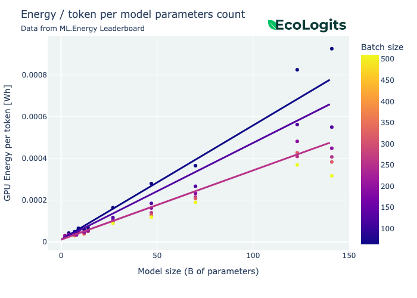

!!! warning "Page still under construction"

    This page is still under construction. If you spot any inaccuracies or have questions on the methodology itself, feel free to contact us.


!!! warning "Early Publication"

    Beware that this is an early version of the methodology to evaluate the environmental impacts of LLMs at inference. We are still in the process testing and reviewing internally. **Some parts of the methodology may change in the near future.**


# Environmental Impacts of LLM Inference


??? info "Known limitations and hypotheses"
    
    - Based on a production setup: models are quantized, high-end servers with A100...
    - Current implementation of EcoLogits assumes a fixed and worldwide impact factor for electricity mix.
    - Model architectures are assumed when not dislosed by the provider.
    - Not accounting the impacts of unused cloud resources, data center building, network and end-user devices...
    - Not tested on multi-modal models for text-to-text generation only.


The environmental impacts of a request $I_{request}$ will be split into the usage impacts $I_{request}^u$ to account for energy consumption and the embodied impacts $I_{request}^e$ to account for resource extraction, hardware manufacturing and transportation.

$$
\begin{equation*}
\begin{split}
I_{request}&=I_{request}^u  + I_{request}^e \\ 
&= E_{request}*F_{em}+\frac{\Delta T}{\Delta L}*I_{server}^e
\end{split}
\end{equation*}
$$

Where $E_{request}$ denotes the energy consumption of the IT resources for the request, $F_{em}$ is the impact factor of the electricity consumption that depends on the location and time, $I_{server}^e$ the embodied impacts of the IT resources and finally $\frac{\Delta T}{\Delta L}$  is the hardware utilization factor i.e. the computation time over the lifetime of the hardware.


## Usage impacts

To determine the usage impacts of an LLM inference we first need to estimate the energy consumption of the server equipped with one or more GPUs. We will also include the energy consumption of cooling equipments integrated with the datacenter using the Power Usage Effectiveness (PUE).

Then we can compute environmental impacts with known $F_{em}$ impact factor for the energy consumption. $F_{em}$ ideally varies with location and time.

### Modeling GPU energy consumption

Using open dataset from the [LLM Perf Leaderboard](https://huggingface.co/spaces/optimum/llm-perf-leaderboard) produced by Hugging Face, we can estimate the energy consumption of the GPU based on a parametric model.

We fit a linear regression model on the dataset modeling the energy consumption per output token given the number of active parameters of the LLM $P_{active}$.

??? note "What are active parameters?"

    We differentiate active parameters and total parameters count for Sparse Mixture-of-Experts (SMoE) models. Typically, the number of total parameters will be used to count the number of required GPUs to load the models, whereas the number of active parameters will be used to estimate the energy consumption of a single GPU. In practice, a SMoE will have lower energy consumption per GPU compared to a dense model of the equivalent size.

    * For a dense model: $P_{active} = P_{total}$
    * For a SMoE model: $P_{active} =  P_{total} / \text{number of active experts}$

??? info "On the LLM Perf Leaderboard dataset filtering"
    
    We have filtered the dataset to keep relevant data points for the analysis. In particular we have applied the following conditions:
    
    * Model number of parameters >= 7B
    * Keep dtype set to float16
    * GPU model is "NVIDIA A100-SXM4-80GB"
    * No optimization
    * 8bit and 4bit quantization excluding bitsandbytes (bnb)


<figure markdown="span">
  
  <figcaption>Figure: Energy consumption (in Wh) per output token vs. number of active parameters (in billions)</figcaption>
</figure>

$$
\frac{E_{GPU}}{\#T_{out}} = \alpha * P_{active} + \beta
$$


We found $\alpha=8.91e-5$ and $\beta=1.43e-3$. Then we can estimate the energy consumption of the GPU for the whole request given the number of output tokens $\#T_{out}$ and the number of active parameters $P_{active}$.

$$
E_{GPU}(\#T_{out}, P_{active}) = \#T_{out} * (\alpha * P_{active} + \beta)
$$

If the model requires multiple GPUs to be loaded in VRAM the energy consumption $E_{GPU}$ will be multiplied by the number of GPUs $\#GPU_{required}$ ([see bellow](#complete-server-energy-consumption)).


### Modeling server energy consumption

To estimate the energy consumption of the whole server we will use the previously estimated GPU energy modeling and estimate separately the energy consumption of the server itself (without GPUs) $E_{server\\GPU}$.

#### Server energy consumption without GPUs

The modeling of the energy consumption of the server without GPUs we will consider a fixed power consumption $W_{server\backslash GPU}$ during inference (or generation latency) denoted $\Delta T$. We also assume that the server hosts multiple GPUs, but not all GPUs are actively used for the target inference, so we will account for a portion of the energy consumption based on the number of required GPUs $\#GPU_{required}$.

$$
E_{server\backslash GPU}(\Delta T) = \Delta T * W_{server\backslash GPU} * \frac{\#GPU_{required}}{\#GPU_{installed}}
$$

We use $W_{server\backslash GPU}=1\ kW$ and $\#GPU_{installed}=8$ for a typical high-end GPU accelerated cloud instance.

#### Estimating the generation latency

The generation latency $\Delta T$ is the duration of the inference measured on the server so it is thus independent of the networking latency. We estimate the generation latency using the [LLM Perf Leaderboard](https://huggingface.co/spaces/optimum/llm-perf-leaderboard) dataset with the same previous mentioned filters applied. 

We fit a linear regression model on the dataset modeling the generation latency per output token given the number of active parameters of the LLM $P_{active}$.

<figure markdown="span">
  
  <figcaption>Figure: Latency (in s) per output token vs. number of active parameters (in billions)</figcaption>
</figure>

$$
\frac{\Delta T}{\#T_{out}} = A * P_{active} + B
$$

We found $A=8.02e-4$ and $B=2.23e-2$. Then we can estimate the generation latency for the whole request given the number of output tokens $\#T_{out}$ and the number of active parameters $P_{active}$. When possible we also measure the request latency $\Delta T_{request}$ and use it has maximum bound for the generation latency. 

$$
\Delta T(\#T_{out}, P_{active}) = \#T_{out} * (A * P_{active} + B)
$$

When possible we also measure the request latency $\Delta T_{request}$ and use it has maximum bound for the generation latency, so the generation latency is defined as following.

$$
\Delta T(\#T_{out}, P_{active}, \Delta T_{request}) = \min[\#T_{out} * (A * P_{active} + B), \Delta T_{request}]
$$

#### Estimating the number of active GPUs

To estimate the number of required GPUs $\#GPU_{required}$ used to load the model in virtual memory we simply use divide the required memory to host the LLM for inference $M_{model}$ by the memory available on one GPU $M_{GPU}$.

The required memory to host the LLM for inference is estimated based on the total number of parameters and the number of bits used for model weights related to quantization. We also apply a memory overhead of $1.2$. [REF]

$$
M_{model}(P_{total},Q)=\frac{P_{total}*Q}{8}*1.2
$$

Then estimating the number of required GPUs, rounded up.

$$
\#GPU_{required}(P_{total},Q,M_{GPU}) = \lceil \frac{M_{model}(P_{total},Q)}{M_{GPU}}\rceil
$$

To stay inline with previous assumptions based on LLM Perf Leaderboard data, we use $M_{GPU}=80\ GB$ for an NVIDIA A100 80GB GPU.

#### Complete server energy consumption

The server energy consumption for the request is the following:

$$
E_{server} = E_{server\backslash GPU} + \#GPU_{required} * E_{GPU}
$$

### Modeling request energy consumption

For now, we consider that the energy consumption of the request is equal to the previously computed server energy multiplied by the PUE to account for cooling equipments of the data center. 

$$
E_{request} = PUE * E_{server}
$$

We typically use a $PUE=1.2$ for a hyperscaler data center or super-computer.

### Modeling request usage environmental impacts

To then assess the environmental impacts of the request **for the usage phase**, we multiply the electricity consumption by the impact factor of the electricity mix $F_{em}$ for the target country and time. We currently use a worldwide average multicriteria impact factor from the [ADEME Base Empreinte®](https://base-empreinte.ademe.fr/).

$$
I^u_{request} = E_{request} * F_{em}
$$

??? note "Some values of $F_{em}$ per geographical area"
        
    | Area or country                                                           | GWP ($gCO2eq / kWh$) | ADPe ($kgSbeq / kWh$) | PE ($MJ / kWh$) |
    |---------------------------------------------------------------------------|--------------------|---------------------|---------------|
    | 🌐 Worldwide                                                              | $590.4$            | $7.378 * 10^{-8}$   | $9.99$        |
    | 🇪🇺 Europe ([EEA](https://en.wikipedia.org/wiki/European_Economic_Area)) | $509.4$            | $6.423 * 10^{-8}$   | $12.9$        |
    | 🇺🇸 USA                                                                  | $679.8$            | $9.855 * 10^{-8}$   | $11.4$        |
    | 🇨🇳 China                                                                | $1,057$            | $8.515 * 10^{-8}$   | $14.1$        |
    | 🇫🇷 France                                                               | $81.3$            | $4.858 * 10^{-8}$   | $11.3$        |


## Embodied impacts

To determine the embodied impacts of an LLM inference we will need to estimate the **hardware configuration** used to host the model and its **lifetime**. The embodied impacts account for the resource extraction (e.g. minerals and metals), manufacturing and transportation of the hardware.

### Modeling server embodied impacts

To estimate the embodied impacts of IT hardware we use the [BoaviztAPI](https://github.com/Boavizta/boaviztapi) tool from the non-profit [Boavizta](https://boavizta.org/en/). This API embeds a bottom-up multicriteria environment impact estimation engine for embodied and usage phases of IT resources and services. We will stick to part were we estimation the embodied impacts of a server and a GPU. BoaviztAPI is an open-source project that relies on open databases and open research on environmental impacts of IT equipments. 

#### Server embodied impacts without GPU

To assess the embodied environmental impacts of a high-end AI server we use a cloud instance from AWS as a reference. The instance selected is a `p4de.24xlarge` because it corresponds to a server that could be used for LLM inference using eight NVIDIA A100 80GB GPU cards. These numbers will be used to estimate the embodied impacts of the server without GPUs $I^e_{server\backslash GPU}$.

Embodied environmental impacts of the cloud instance:

|                 | Server (without GPU) |
|-----------------|----------------------|
| GWP ($kgCO2eq$) | $3000$               |
| ADPe ($kgSbeq$) | $0.25$               |
| PE ($MJ$)       | $39,000$             |

!!! warning "These impacts does not take into account the eight GPUs. ([see bellow](#gpu-embodied-impacts))"

??? info "Example request to reproduce this calculation"

    On the cloud instance route (/v1/cloud/instance) you can POST the following JSON.
    
    ```json
    {
        "provider": "aws",
        "instance_type": "p4de.24xlarge"
    }
    ```

    Or you can use the demo available demo API with this command using `curl` and parsing the JSON output with `jq`.

    ```shell
    curl -X 'POST' \
        'https://api.boavizta.org/v1/cloud/instance?verbose=true&criteria=gwp&criteria=adp&criteria=pe' \
        -H 'accept: application/json' \
        -H 'Content-Type: application/json' \
        -d '{
        "provider": "aws",
        "instance_type": "p4de.24xlarge"
    }' | jq
    ```

#### GPU embodied impacts

Boavizta is working internally on a methodology to provide multicriteria embodied impacts for GPU cards. We have access to the numbers computed for a NVIDIA A100 80GB GPU. These numbers will be used to estimate the embodied impacts of a single GPU $I^e_{GPU}$.

|                 | NIDIA A100 80GB  |
|-----------------|------------------|
| GWP ($kgCO2eq$) | $143$            |
| ADPe ($kgSbeq$) | $5.09 * 10^{-3}$ |
| PE ($MJ$)       | $1,828$          |

!!! warning "The GPU embodied impacts will be soon available in the BoaviztAPI tool."


#### Complete server embodied impacts

The final embodied impacts for the server including the GPUs is expressed as following. Note that the embodied impacts of the server without GPUs is scaled by the number of GPUs required to host the model. This allocation has been made so that we can consider that the rest of the GPUs on the server can be used to host other models (or the same model multiple times). As we are estimating the impacts of a LLM inference on a unique service we need to exclude the embodied impacts that will be attributed to the other services hosted on that server.

$$
I^e_{server}=\frac{\#GPU_{required}}{\#GPU_{installed}}*I^e_{server\backslash GPU} + \#GPU_{required} * I^e_{GPU}
$$


### Modeling request embodied environmental impacts

To allocate the server embodied impacts to the request we use a allocation based on the hardware utilization factor $\frac{\Delta T}{\Delta L}$. With $\Delta L$ being the lifetime of the server and GPU fixed to 5 years.

$$
I^e_{request}=\frac{\Delta T}{\Delta L} * I^e_{server}
$$


## References

- [LLM-Perf Leaderboard](https://huggingface.co/spaces/optimum/llm-perf-leaderboard) to estimate GPU energy consumption and latency based on the model architecture and number of output tokens.
- [BoaviztAPI](https://github.com/Boavizta/boaviztapi) to estimate server embodied impacts and base energy consumption.
- [ADEME Base Empreinte®](https://base-empreinte.ademe.fr/) for electricity mix impacts per country.

## :material-bookshelf: Citation

```bibtex
Coming soon...
```

## :material-scale-balance: License

**This work is licensed under [CC BY-SA 4.0](https://creativecommons.org/licenses/by-sa/4.0/)**


